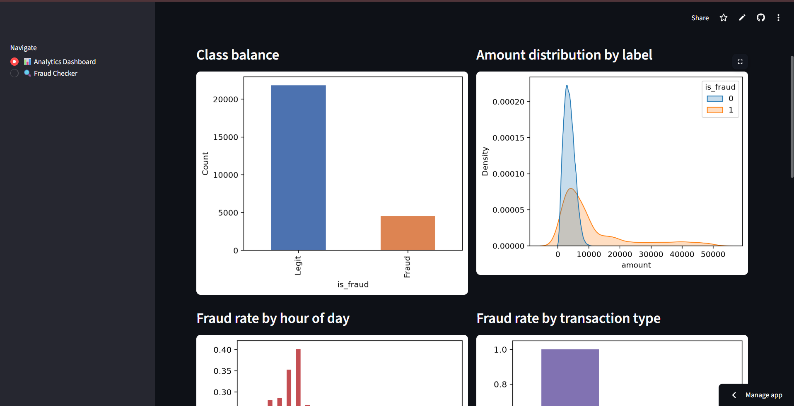

# UPI Fraud Detection


An end-to-end data analytics + ML project: EDA on UPI transaction data, a trained
fraud-detection model, and a deployed Streamlit app with a live analytics
dashboard and a fraud risk checker.

🔗 **Live app**: [upi-fraud-detection-hasrdz558uyv8g6fmhaels.streamlit.app](https://upi-fraud-detection-hasrdz558uyv8g6fmhaels.streamlit.app/)

📦 **Source**: [github.com/KushagraJaiswal03/upi-fraud-detection](https://github.com/KushagraJaiswal03/upi-fraud-detection)



## Project structure

```
upi_fraud/
├── data/
│   └── upi_transactions.csv       # training data
├── app/
│   ├── features.py                # shared feature engineering (train + app use this)
│   ├── train.py                   # EDA + preprocessing + model training + evaluation
│   └── app.py                     # Streamlit app (2 pages: dashboard + fraud checker)
├── models/
│   └── fraud_pipeline.joblib      # trained pipeline (preprocessing + model), generated by train.py
├── outputs/                       # charts + metrics report, generated by train.py
├── requirements.txt
└── README.md
```

## How the model works

1. **`features.py`** turns raw columns into model-ready features: parses the
   `location` string into lat/lon, converts stringified list columns
   (e.g. `permissions_granted`) into counts, turns high-cardinality text into
   presence flags, and drops IDs/free text that carry no signal.
2. **`train.py`**:
   - Runs EDA and saves charts to `outputs/`.
   - Splits data 80/20 (stratified on fraud label).
   - Builds a `ColumnTransformer` (scaling numeric features, one-hot encoding
     categoricals) + `SMOTE` (to address the ~17% fraud class imbalance) +
     classifier, all as one `imblearn` Pipeline.
   - Trains and compares Logistic Regression, Random Forest, and XGBoost using
     ROC-AUC, precision, recall, and F1 (not plain accuracy, since accuracy is
     misleading on imbalanced data).
   - Saves the best pipeline (Random Forest here, chosen for interpretability
     via feature importances) to `models/fraud_pipeline.joblib`, along with
     default/typical values for every feature the app doesn't ask about directly.
3. **`app.py`** loads that saved pipeline and serves two pages:
   - **Analytics Dashboard**: class balance, amount distributions, fraud rate
     by hour/type, and the model's top fraud signals.
   - **Fraud Checker**: a form for the transaction details that matter most
     (amount, receiver account age, handle verification, unusual flags, etc.);
     everything else defaults to a typical value, and the model returns a
     fraud probability and risk verdict.

**Honest caveat**: this particular dataset is synthetic and generated with
strongly separable fraud patterns, so the model scores near-perfectly on it.
That's expected for this kind of demo data — real-world fraud data is noisier,
so treat this as a demonstration of the *pipeline and methodology* (imbalance
handling, proper train/test evaluation, explainability) rather than a claim
that 100% accuracy is achievable in production.

## Run it locally

```bash
cd upi_fraud
pip install -r requirements.txt

# (re)train the model — optional, fraud_pipeline.joblib is already included
cd app
python train.py

# launch the app
streamlit run app.py
```

## Deploy it for free (Streamlit Community Cloud)

1. **Push this folder to a public (or private) GitHub repo.**
   ```bash
   cd upi_fraud
   git init
   git add .
   git commit -m "UPI fraud detection app"
   git branch -M main
   git remote add origin https://github.com/<your-username>/<repo-name>.git
   git push -u origin main
   ```
2. Go to **[share.streamlit.io](https://share.streamlit.io)** and sign in with GitHub.
3. Click **"New app"**, pick your repo/branch, and set the **main file path** to:
   ```
   app/app.py
   ```
4. Click **Deploy**. Streamlit Cloud installs `requirements.txt` automatically
   and gives you a public URL like `https://<your-app>.streamlit.app`.
5. Any time you `git push` an update, the deployed app redeploys automatically.

### If the app can't find the model or data on deploy
Streamlit Cloud runs from the repo root, and the app uses relative paths
(`../models/...`, `../data/...`) based on its own file location, so as long as
the folder structure above is preserved in your repo, it works out of the box.

## Retraining on your own data

Swap in your own CSV at `data/upi_transactions.csv` (keep the same column
names, or adjust `features.py` to match), then re-run `python train.py` from
inside `app/`. It regenerates the charts and the saved model automatically.
